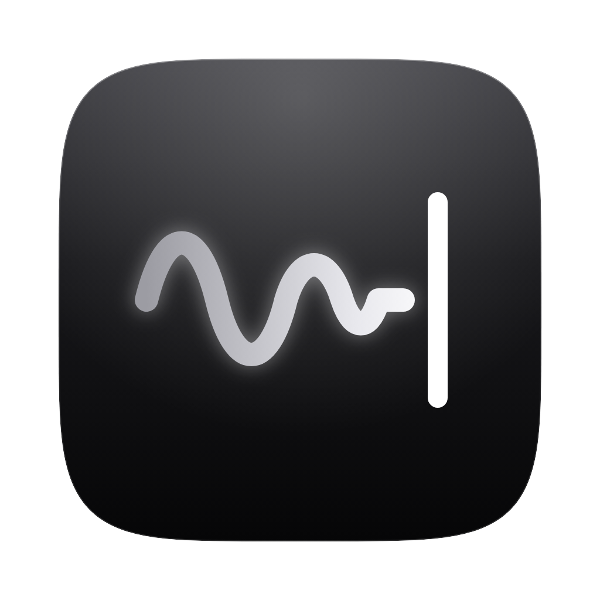

<div align="center">



# 默契 Moqi

**Dictation that gets you** — Mandarin, English, and everything in between.

Hold the right Option key, speak, let go. The text appears at your cursor.<br>
Your voice is recognized on your Mac and never uploaded.

[](https://github.com/DDChen666/moqi/releases/latest)
[](docs/安裝教學-Mac.md)
[](LICENSE)
[](docs/隱私.md)

[繁體中文](README.md) · **English**


[**▶︎ Watch the 1-minute intro**](https://github.com/DDChen666/moqi/releases/download/v1.0.0/Moqi-intro-1080p.mp4) (Chinese) · [Download](https://github.com/DDChen666/moqi/releases/latest)

</div>

---

## Why

Many people in Taiwan and across the Chinese-speaking tech world talk like this: 「幫我把這個 PR 的 description 改短一點」 ("shorten this PR's description for me"). Most dictation tools either translate the English words into Chinese or flip the whole sentence into English. The ones that handle it well send your voice to the cloud and charge a subscription.

Moqi aims for three things: **understand code-switched speech, know where you're typing, and keep your voice on your computer.**

## Features

- **🗣 Code-switching that just works** — English words stay English. The speech model (Qwen3-ASR 1.7B) was chosen by testing 8 on-device models on 30 real mixed-language recordings ([benchmarks](docs/評測.md)).
- **🧹 Say it messy, get it clean** — Drops fillers ("嗯", "那個"), keeps only your final wording when you correct yourself, turns spoken lists into lists. It never swaps your vocabulary.
- **🧭 Adapts to the app** — Casual in chat apps (no trailing period, no accidental send); every detail and file name intact in Claude Code and terminals; bullet points in Notes.
- **⚡️ Transcribes while you talk** — Each pause lets Moqi recognize what you said so far. Speak for 30 s and the cleaned-up text lands about 1.8 s after you let go.
- **🔒 Your voice stays local** — Recognition runs entirely on your Mac. Sending the text to an AI for clean-up is optional, and every request is shown in your history.
- **🫧 Stays out of the way** — Never steals focus, copies instead of pasting if you switched windows mid-sentence, and restores your clipboard.

<p align="center">
  <picture>
    <source media="(prefers-color-scheme: dark)" srcset="docs/media/screenshot-home-dark.png">
    
  </picture>
</p>

## Install

**Requires** an Apple silicon Mac (M1 or later), macOS 15 or later, and about 2 GB of disk space.

1. Download `Moqi_1.0.0_aarch64.dmg` from [Releases](https://github.com/DDChen666/moqi/releases/latest) and drag Moqi into Applications.
2. The first launch is blocked by macOS because Moqi isn't signed with a paid Apple Developer ID. Open **System Settings → Privacy & Security** and click **Open Anyway**. If macOS says the app "is damaged", run `xattr -dr com.apple.quarantine /Applications/Moqi.app` in Terminal.
3. Follow the three setup steps: allow Microphone and Accessibility, choose Raw or Tidy, and try a sentence.

The interface is available in Traditional Chinese and English (Settings → Language).

## Usage

| To                 | Do                                              |
| ------------------ | ----------------------------------------------- |
| Dictate            | Hold right ⌥ Option, speak, release             |
| Dictate hands-free | Double-tap right ⌥ Option, speak, tap once more |
| Cancel             | Esc                                             |
| Paste again        | Menu bar icon → Paste Last Result               |

| Level                  | What it does                                           | Needs                                                                                           |
| ---------------------- | ------------------------------------------------------ | ----------------------------------------------------------------------------------------------- |
| **Raw**                | Punctuation, Traditional Chinese, your dictionary      | Nothing — fully on-device                                                                       |
| **Tidy** (recommended) | Removes fillers and false starts, formats spoken lists | An API key for the clean-up service (DeepSeek by default; any OpenAI-compatible endpoint works) |
| **Polish**             | Rewrites into written prose                            | Same                                                                                            |

## Privacy

|                   |                                                                                     |
| ----------------- | ----------------------------------------------------------------------------------- |
| Your voice        | Never leaves your Mac                                                               |
| Sent for clean-up | Only the recognized text, your dictionary words, and a context label such as "chat" |
| Never sent        | Audio, app names, window titles, what was already in the text field                 |
| API key           | macOS Keychain only                                                                 |
| Otherwise         | No account, no analytics, no auto-update                                            |

Details (in Chinese): [docs/隱私.md](docs/隱私.md)

## Numbers

|                                                     |                                      |
| --------------------------------------------------- | ------------------------------------ |
| Meaning errors on 30 real mixed-language clips      | **3** (fewest of 8 on-device models) |
| Meaning preserved after clean-up                    | **27 / 30**                          |
| Release to text, 30 s+ dictation (real use, median) | **1.8 s**                            |
| Key press to recording                              | **0.07 s**                           |

These come from one speaker's recordings on an M3 MacBook Air; see [the benchmark write-up](docs/評測.md) for the method and its limits.

## Roadmap

- [ ] **Learns your words** — fix a word once and Moqi gets it right next time. Recognition-side vocabulary is done on the `v1.1` branch (English terms correct 71% → 87%).
- [ ] **Windows**
- [ ] **On-device clean-up** with a small local language model, so not even text leaves your computer.
- [ ] **Learns your typing habits** (spaces vs. line breaks, punctuation), off by default.

## Build from source

Xcode Command Line Tools, Rust, Bun and CMake on an Apple silicon Mac:

```sh
bun install
bun run tauri dev
```

Release builds, signing and troubleshooting: [BUILD.md](BUILD.md). Architecture: [docs/架構.md](docs/架構.md). Contributions welcome in English or Chinese — see [CONTRIBUTING.md](CONTRIBUTING.md).

## Credits

- [**Handy**](https://github.com/cjpais/Handy) by CJ Pais (MIT) — the foundation: hotkeys, overlay, recording and transcription. See [FORK.md](FORK.md).
- [**Qwen3-ASR**](https://github.com/QwenLM/Qwen3-ASR) (Apache 2.0) — speech recognition.
- [**transcribe.cpp**](https://github.com/handy-computer/transcribe.cpp) (MIT) — on-device inference.
- [**Silero VAD**](https://github.com/snakers4/silero-vad) (MIT) — voice activity detection.
- [**OpenCC**](https://github.com/BYVoid/OpenCC) (Apache 2.0) — Chinese conversion and Taiwan wording.
- [**Tauri**](https://tauri.app/)

## License

[MIT](LICENSE)
