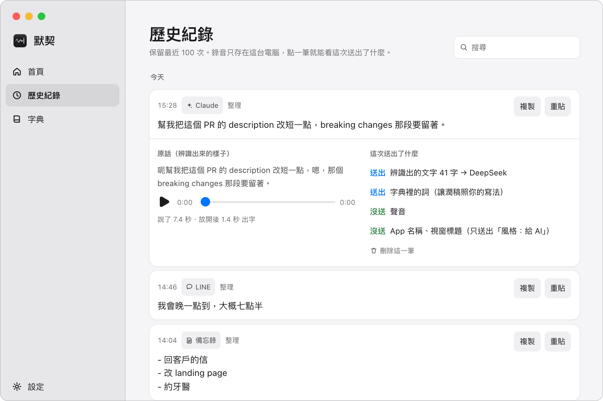
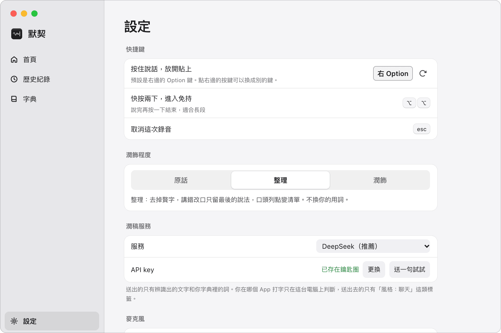

# 默契 Moqi

**讓默契幫你打字。** 中英夾雜，一聽就懂。

按住右 Option 說話，放開，字就出現在游標上。 
聲音在你的 Mac 上辨識，不會上傳。

**繁體中文** · [English](README.en.md)

[**▶︎ 看 1 分鐘介紹影片**](https://github.com/DDChen666/moqi/releases/download/v1.0.0/Moqi-intro-1080p.mp4) · [下載](https://github.com/DDChen666/moqi/releases/latest) · [安裝教學](docs/安裝教學-Mac.md) · [使用指南](docs/使用指南.md)

---

## 為什麼做默契

我每天打字都是中英夾雜：「幫我把這個 PR 的 description 改短一點」。現有的語音輸入不是把英文翻成中文，就是整句變成英文；好用的又要把聲音送上雲端、按月付費。

默契想做到三件事：**聽得懂中英夾雜、懂你在哪裡打字、聲音不出電腦。**

## 特色

- **🗣 中英夾雜，一聽就懂** — 英文照原樣留下，不翻譯、不亂拆。辨識模型是用 30 段真人錄音比較 8 個本機模型後選出的（[評測](docs/評測.md)）。
- **🧹 說得亂，寫得清楚** — 去掉「嗯、那個」，說錯改口只留最後的說法，口頭列點變清單。不換你的用詞。
- **🧭 看場合整理** — 在 LINE 像聊天，句尾不加句號、不會誤送出；在 Claude Code 和終端機，指令和檔名一字不漏；在備忘錄變成條列。
- **⚡️ 邊說邊轉** — 你停頓時就先辨識前面那段。說 30 秒，放開後約 1.8 秒出字（含整理）。
- **🔒 聲音不出電腦** — 辨識全程在本機。要不要交給 AI 整理由你決定，每一次送出了什麼都看得到。
- **🫧 不打擾** — 不搶游標；說到一半換了視窗就改成複製，不會貼錯地方；貼完還原你的剪貼簿。

  <picture>
    <source media="(prefers-color-scheme: dark)" srcset="docs/media/screenshot-home-dark.png">
    
  </picture>

## 下載與安裝

**需要**：Apple 晶片的 Mac（M1 以後）、macOS 15 以後、約 2 GB 空間。

1. 到 [Releases](https://github.com/DDChen666/moqi/releases/latest) 下載 `Moqi_1.0.0_aarch64.dmg`，把「默契」拖進「應用程式」。
2. 第一次打開會被 macOS 擋下（默契是免費開源軟體，沒有付費取得 Apple 簽章）。到「系統設定」→「隱私權與安全性」，按「**強制打開**」。
3. 跟著畫面完成三步：允許麥克風和輔助使用、選「原話」或「整理」、試說一句。

一步一步的圖文說明、出現「已損毀」時怎麼辦：[**安裝教學**](docs/安裝教學-Mac.md)

## 怎麼用

| 想做的事 | 怎麼做                            |
| -------- | --------------------------------- |
| 說一句話 | 按住右 ⌥ Option 說，放開          |
| 說一大段 | 快按兩下右 ⌥ Option，說完再按一下 |
| 取消     | Esc                               |
| 再貼一次 | 選單列圖示 →「貼上上一次」        |

三種潤飾程度：

| 程度             | 做什麼                                 | 需要                                |
| ---------------- | -------------------------------------- | ----------------------------------- |
| **原話**         | 只加標點、轉繁體、套用字典             | 什麼都不用，全程本機                |
| **整理**（推薦） | 去贅字、改口只留最後的說法、列點變清單 | 潤稿服務的 API key（預設 DeepSeek） |
| **潤飾**         | 重組句子，讀起來像寫的                 | 同上                                |

更多：[使用指南](docs/使用指南.md)（場合怎麼判斷、字典、歷史紀錄、常見問題）

<table>
  <tr>
    <td width="50%"></td>
    <td width="50%"></td>
  </tr>
  <tr>
    <td align="center">每一筆都看得到「這次送出了什麼」</td>
    <td align="center">潤飾程度與潤稿服務由你選</td>
  </tr>
</table>

## 隱私

|            |                                                          |
| ---------- | -------------------------------------------------------- |
| 你的聲音   | 只在這台 Mac。錄音留在歷史紀錄，可以隨時刪除             |
| 送去整理的 | 只有辨識出的文字、你字典裡的詞、場合類別（例如「聊天」） |
| 不送出的   | 聲音、App 名稱、視窗標題、輸入框原本的內容               |
| API key    | 存在 macOS 鑰匙圈，不寫進任何檔案                        |
| 其他       | 沒有帳號、沒有追蹤、不會自動更新                         |

完整說明：[docs/隱私.md](docs/隱私.md)

## 數字

|                                   |                                |
| --------------------------------- | ------------------------------ |
| 意思聽錯（30 段真人中英夾雜錄音） | **3 段**（8 個本機模型中最少） |
| 整理後意思正確                    | **27 / 30** 段                 |
| 說 30 秒以上，放開到出字          | **1.8 秒**（中位數，實際使用） |
| 按下到開始收音                    | **0.07 秒**                    |

方法與侷限：[docs/評測.md](docs/評測.md)

## 接下來

- [ ] **自動學詞**：你改過的字，默契下次就寫對。辨識端字典已經在 `v1.1` 分支完成（英文詞寫對 71% → 87%）。
- [ ] **Windows 版**
- [ ] **本機整理**：用小型語言模型在電腦上整理，連文字都不送出。
- [ ] **學你的打字習慣**：空格還是換行、標點習慣，預設關閉。

## 文件

|                                  |                                      |
| -------------------------------- | ------------------------------------ |
| [安裝教學](docs/安裝教學-Mac.md) | 第一次打開、權限、更新、移除         |
| [使用指南](docs/使用指南.md)     | 操作、潤飾程度、場合、字典、常見問題 |
| [隱私](docs/隱私.md)             | 送出什麼、存在哪裡、怎麼全部刪除     |
| [評測](docs/評測.md)             | 為什麼選這個模型、這個整理方式       |
| [架構](docs/架構.md)             | 給想讀程式碼的人                     |
| [從原始碼編譯](BUILD.md)         | 開發環境、簽章                       |
| [參與](CONTRIBUTING.md)          | 回報問題、提交修改                   |
| [變更紀錄](CHANGELOG.md)         | 每一版改了什麼                       |

## 致謝

默契站在這些開源專案上：

- [**Handy**](https://github.com/cjpais/Handy)（CJ Pais，MIT）— 快捷鍵、懸浮窗、錄音與辨識的基礎。分支方式見 [FORK.md](FORK.md)。
- [**Qwen3-ASR**](https://github.com/QwenLM/Qwen3-ASR)（阿里巴巴通義千問，Apache 2.0）— 語音辨識模型。
- [**transcribe.cpp**](https://github.com/handy-computer/transcribe.cpp)（MIT）— 在 Mac 上跑辨識模型。
- [**Silero VAD**](https://github.com/snakers4/silero-vad)（MIT）— 靜音偵測。
- [**OpenCC**](https://github.com/BYVoid/OpenCC)（Apache 2.0）— 簡繁轉換與台灣用詞。
- [**Tauri**](https://tauri.app/) — 桌面 App 框架。

## 授權

[MIT](LICENSE)。
